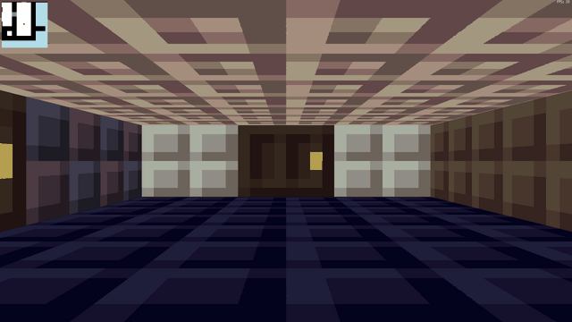

# cub3D

A Wolfenstein 3D-style raycasting engine in C with the MiniLibX. 42 school project, built as a pair (2024).



## Features

- Raycasting with DDA: one ray per screen column, perpendicular wall distance (no fish-eye), camera plane giving a field of view of about 66°.
- Wall texture chosen by the side of the wall hit (north, south, east, west).
- Textured floor and ceiling (floorcasting).
- Minimap centered on the player and FPS counter.
- Doors that open and close with `E`.
- Wall collisions with sliding, rotation with the arrow keys or the mouse.
- Scene loaded from a `.cub` file and validated: textures, floor and ceiling colors (0 to 255), allowed characters, a single starting position that also sets the initial direction, map closed by walls.
- 1920×1080 window.

## Build and run

Linux only (X11), built and run on Debian 12 with GCC 12. Requirements: `cc`, `make`, the X11 development headers and libbsd (`sudo apt install libx11-dev libxext-dev libbsd-dev`). The libft and the MiniLibX are git submodules.

```sh
git clone --recursive https://github.com/CrystxlSith/CUB3D.git
cd CUB3D
make
./cub3d maps/good_map_doors.cub
```

Run it from the repository root: textures are loaded from `textures/`.

## Controls

| Key | Action |
|---|---|
| `W` / `S` | move forward / backward |
| `A` / `D` | strafe left / right |
| `←` / `→` or mouse | rotate |
| `E` | open or close a door |
| `Esc` | quit |

## Scene file

```
SO textures/tuff.xpm
NO textures/polished_blackstone_bricks_0.xpm
WE textures/black_terracotta.xpm
EA textures/dragon_egg.xpm

F 220,100,0
C 225,30,0

        1111111111111111111111111
        1000000000110000000000001
...
10000000000000001101010010N01
```

`NO` `SO` `WE` `EA` wall textures, `F` and `C` floor and ceiling colors, then the map: `1` wall, `0` floor, `P` door, `N` `S` `E` `W` starting position and direction. Valid and invalid scenes are in `maps/`.

## Project structure

```
main.c, error.c
src/algo/   raycasting (DDA), rendering, floorcasting, minimap, movement, input
src/map/    .cub parsing, map validation, doors
maps/       valid and invalid scenes
textures/   XPM textures
```

## Team

Armel ([@Canybardeloton](https://github.com/Canybardeloton)) and Joaquim ([@CrystxlSith](https://github.com/CrystxlSith)).
